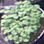

## Easy filtering image computer vision tool

When you have a lot of images and want to filter them into different folders, this repo can help you.

`--input` direct to the directory of your images. \
`--output` direct to the directory to save outcome. \
`--type` write down your classes with comma separation (w/o space). \
i.e. `--type apple,banana,melon`

### example
```bash
python3 main.py --input /media/huijo/SSD_Storage/cropInstance/ecf/raw --output /media/huijo/SSD_Storage/cropInstance/ecf/filtered --type basil,error
```

### Tip
After applying object detection or instant segmentation, each object/instance can be cropped using `bbox`.
Each bbox can be further filtered (more specified classes or false positive samples) using this repo.
[This](https://github.com/hexafarms/openHexa/blob/main/tools/cropInstance.py) is my exaple of cropping samples.

This kind of small cropped images can be easily filtered. \
